# Design Patterns Reference

Thirteen design patterns organized by category. Each entry includes: when to use it,
the generic model (participants and their roles), a Mermaid class diagram of the
generic model, and selection guidance for choosing between related patterns.

Design patterns are industry-proven models for solving common architecture problems.
A pattern is not copy-and-paste code — tailor each pattern's generic model to the
specific problem in the user's application.

---

## Behavioral Patterns

### 1. Template Method

**Problem it solves:** An algorithm has several steps in a fixed order. Some steps are
common across variations, but other steps differ.

**When to use:**
- Multiple classes share the same algorithm structure but differ in specific steps
- Common steps should be implemented once in a superclass
- Varying steps are delegated to subclasses

**Generic model participants:**
- **AlgorithmOutline** (abstract superclass) — Defines `template_method()` that calls
  steps in order. Implements common steps. Declares abstract methods for varying steps.
- **ConcreteAlgorithm** (subclasses) — Implement the varying steps.
- **Client** — Calls `template_method()` on a ConcreteAlgorithm object.

**Mermaid class diagram:**
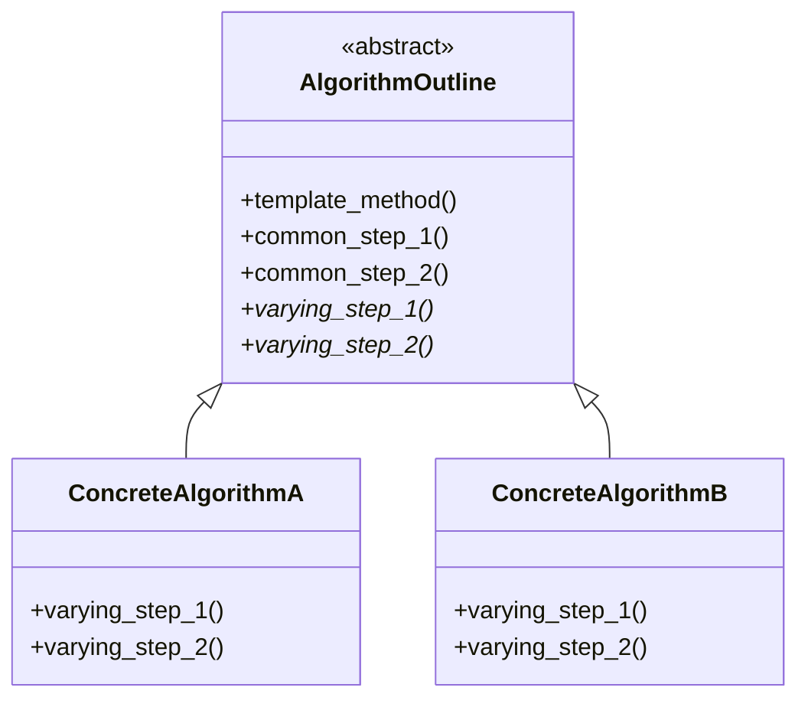

---

### 2. Strategy

**Problem it solves:** An application needs to select from multiple interchangeable
algorithms at runtime.

**When to use:**
- Multiple algorithms exist for the same task
- The choice of algorithm should be made at runtime, not compile time
- Algorithms should be encapsulated and interchangeable

**Generic model participants:**
- **StrategyInterface** (interface) — Declares the method signature all strategies
  must implement.
- **ConcreteStrategy** (classes) — Each implements the strategy interface with a
  specific algorithm.
- **Context** (class) — Holds a reference to a StrategyInterface object. Delegates
  the algorithm to the current strategy. Strategy can be changed at runtime.

**Mermaid class diagram:**
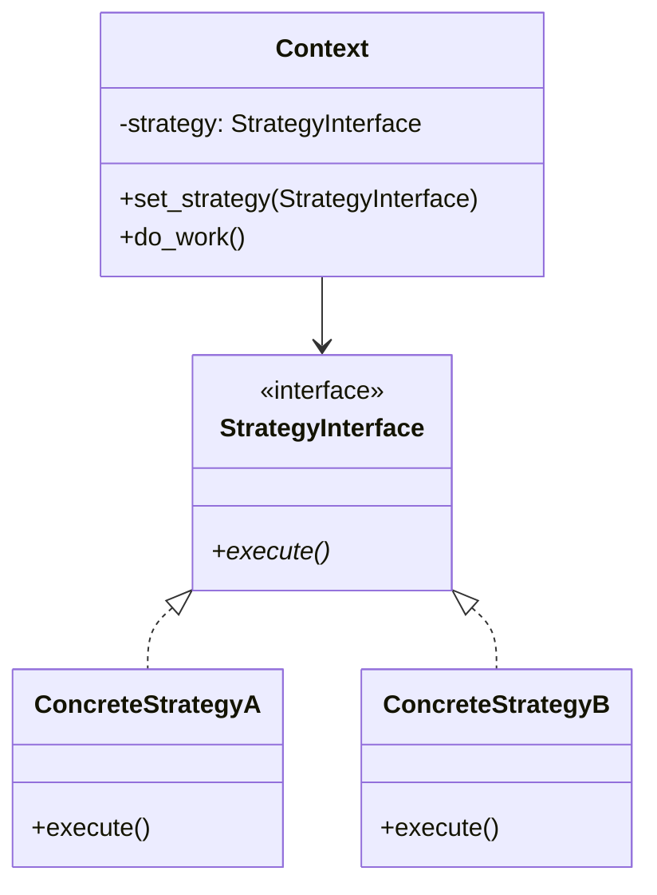

### Template Method vs Strategy

| Criterion | Template Method | Strategy |
|-----------|----------------|----------|
| Mechanism | Inheritance (subclasses override steps) | Composition (inject strategy objects) |
| Flexibility | Fixed at class definition | Changeable at runtime |
| Algorithm structure | Fixed step order with varying steps | Entire algorithm varies |
| When to choose | Steps are in a prescribed order, only some vary | Algorithms are fully interchangeable |

---

### 3. Iterator

**Problem it solves:** A single algorithm must operate on different types of sequential
data collections without knowing how each collection is implemented.

**When to use:**
- An algorithm iterates over collections of objects
- The collections have different implementations (list, tuple, dictionary, tree)
- The algorithm should work with any sequential collection

**Generic model participants:**
- **IteratorInterface** (interface) — Declares methods for sequential access:
  `has_next()`, `next()`.
- **ConcreteIterator** (classes) — Each implements the iterator for a specific
  collection type.
- **CollectionInterface** (interface) — Declares `create_iterator()` method.
- **ConcreteCollection** (classes) — Each returns the appropriate ConcreteIterator.
- **Client** — Uses the IteratorInterface to traverse collections uniformly.

**Mermaid class diagram:**
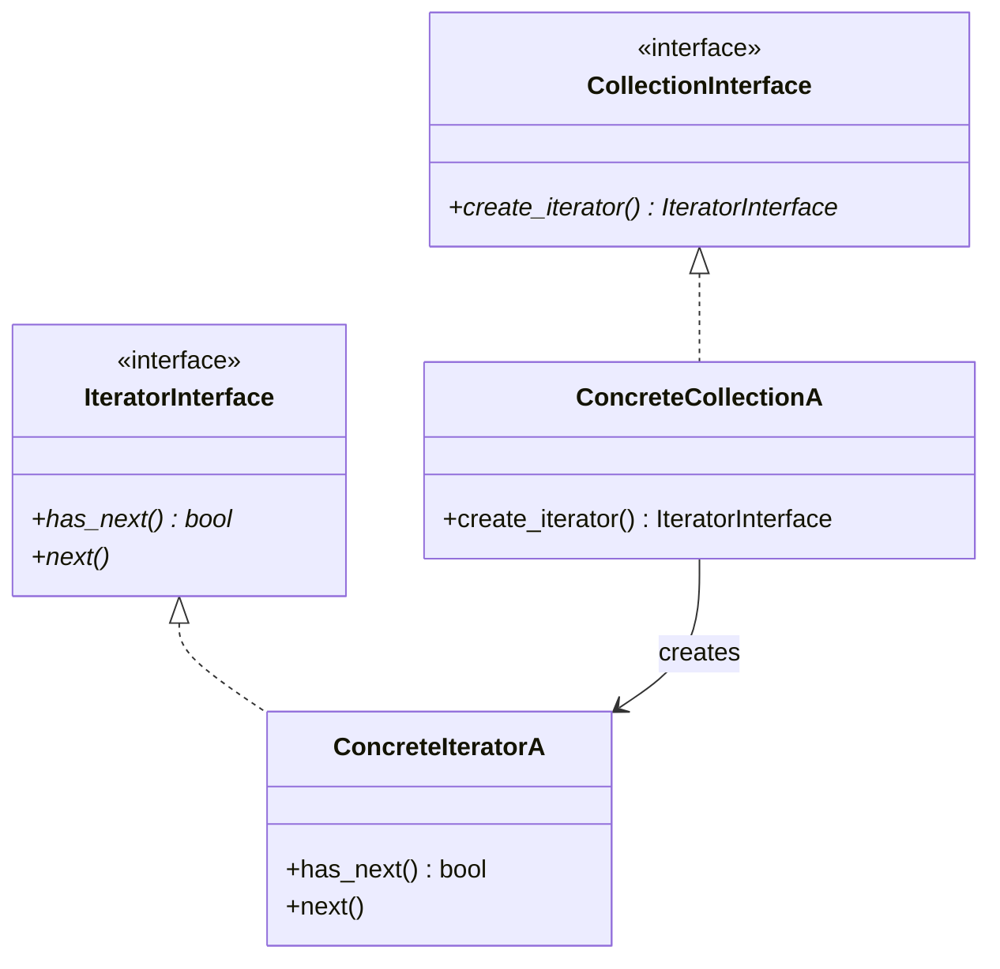

---

### 4. Visitor

**Problem it solves:** Multiple different algorithms must operate on elements in a
single data collection (often a tree), without modifying the element classes.

**When to use:**
- A data structure contains different types of elements
- Multiple unrelated operations must be performed on those elements
- Adding new operations should not require changing element classes

**Generic model participants:**
- **VisitorInterface** (interface) — Declares a `visit()` method for each element type.
- **ConcreteVisitor** (classes) — Each implements a different algorithm across elements.
- **ElementInterface** (interface) — Declares `accept(visitor)` method.
- **ConcreteElement** (classes) — Each calls the appropriate `visit()` on the visitor.
- **ObjectStructure** — The collection that holds elements and lets visitors traverse them.

**Mermaid class diagram:**
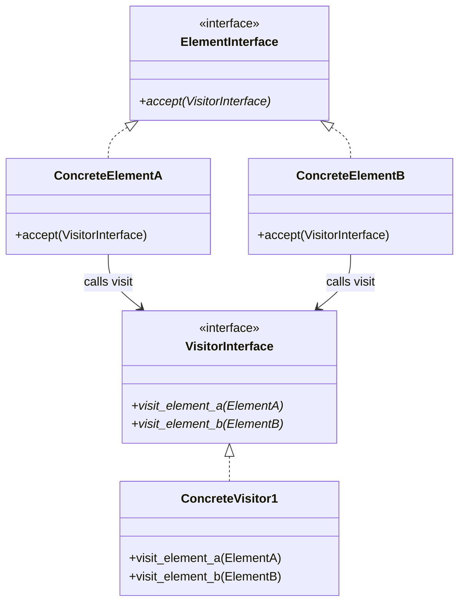

### Iterator vs Visitor

| Criterion | Iterator | Visitor |
|-----------|----------|---------|
| Focus | One algorithm, multiple collection types | Multiple algorithms, one collection |
| Traversal | Sequential access across different collections | Operations across different element types |
| When to choose | Same operation on different data structures | Different operations on same data structure |

---

### 5. Observer

**Problem it solves:** When one object (publisher) changes state, multiple dependent
objects (subscribers) must be notified and updated, without tight coupling between them.

**When to use:**
- One-to-many dependency: one data source, multiple consumers
- Consumers should be added/removed dynamically
- Publisher should not know consumer implementations

**Generic model participants:**
- **SubjectInterface** (interface) — Declares `subscribe()`, `unsubscribe()`, `notify()`.
- **ConcreteSubject** (class) — Maintains subscriber list and state. Calls `notify()`
  when state changes.
- **ObserverInterface** (interface) — Declares `update()` method.
- **ConcreteObserver** (classes) — Each processes notifications differently.

**Mermaid class diagram:**
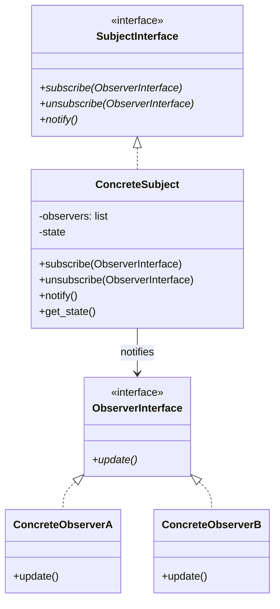

---

### 6. State

**Problem it solves:** An object's behavior depends on its current state, and state
transitions must be managed explicitly.

**When to use:**
- An object can be in one of several named states at runtime
- Behavior changes depending on current state
- State transitions are triggered by events/actions
- Some actions are valid only in certain states

**Generic model participants:**
- **Context** (class) — Maintains a reference to the current StateInterface object.
  Delegates state-dependent behavior to it.
- **StateInterface** (interface) — Declares methods for all possible actions.
- **ConcreteState** (classes) — Each implements behavior for one named state.
  Handles transitions by changing the Context's state reference.

**Mermaid class diagram:**
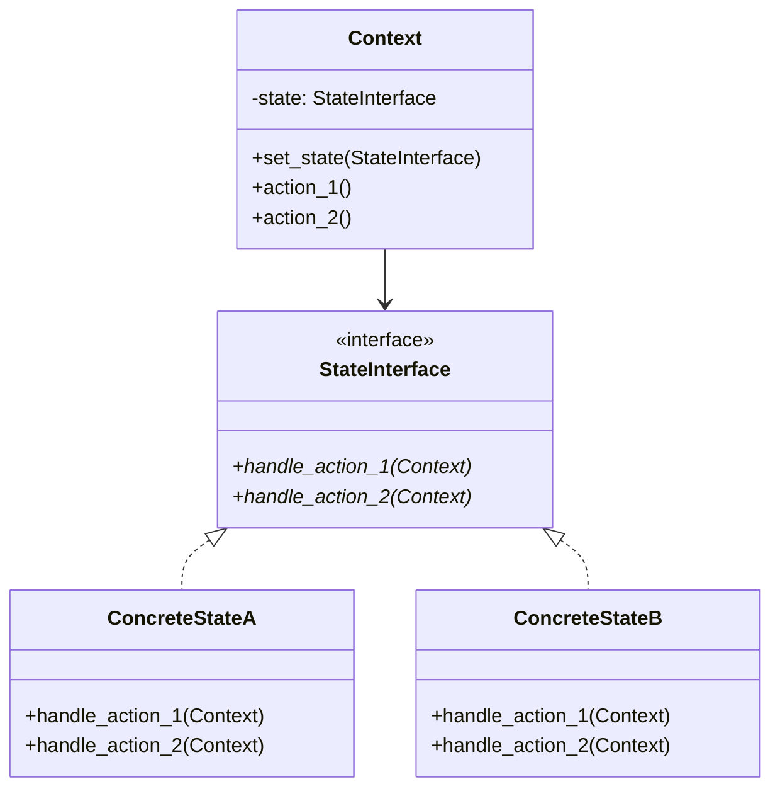

### State vs Visitor

| Criterion | State | Visitor |
|-----------|-------|---------|
| Focus | Object behavior changes with state | Different algorithms on same data |
| Transitions | Explicit state machine with transitions | No state transitions |
| When to choose | Object has named states with different behavior | Need multiple operations on a data structure |

---

## Creational Patterns

### 7. Factory Method

**Problem it solves:** A class needs to create objects but should delegate the choice
of which concrete class to instantiate to its subclasses.

**When to use:**
- A group of related objects must be created
- The creator class should not know which concrete class to instantiate
- Subclasses should determine what objects to create

**Generic model participants:**
- **CreatorInterface** (abstract class) — Declares `factory_method()` that returns
  a ProductInterface. May have other methods that use the product.
- **ConcreteCreator** (subclasses) — Each implements `factory_method()` to create a
  specific ConcreteProduct.
- **ProductInterface** (interface) — Declares the interface for created objects.
- **ConcreteProduct** (classes) — The actual objects created by the factory.

**Mermaid class diagram:**
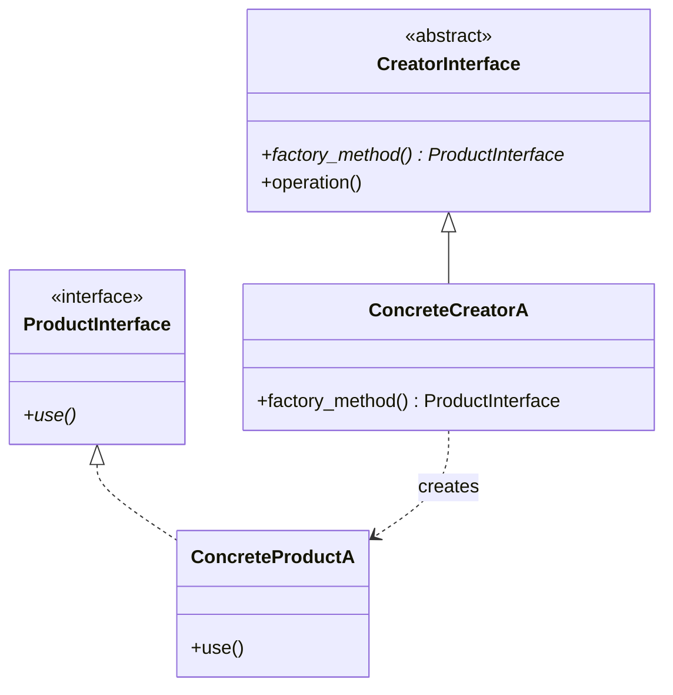

---

### 8. Abstract Factory

**Problem it solves:** An application must create families of related objects and
prevent mixing objects from different families.

**When to use:**
- Multiple families of related objects exist
- Objects from different families must not be mixed
- Adding new families should be straightforward

**Generic model participants:**
- **AbstractFactory** (interface) — Declares creation methods for each product type.
- **ConcreteFactory** (classes) — Each creates products from one family.
- **AbstractProduct** (interfaces) — Declare interfaces for each product type.
- **ConcreteProduct** (classes) — Family-specific implementations.

**Mermaid class diagram:**
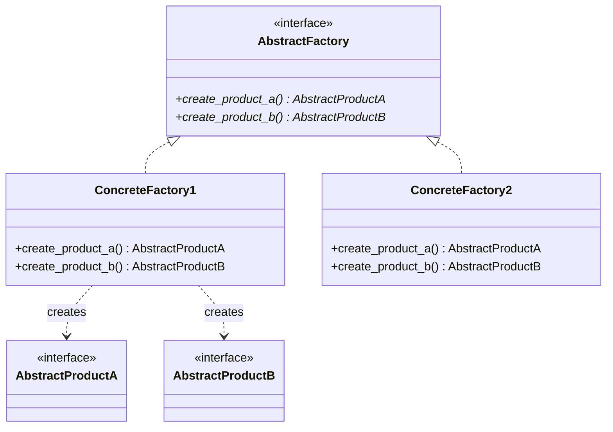

### Factory Method vs Abstract Factory

| Criterion | Factory Method | Abstract Factory |
|-----------|---------------|-----------------|
| Scope | Creates one type of product | Creates families of products |
| Mechanism | Subclass overrides one factory method | Object implements multiple factory methods |
| Family safety | No family concept | Prevents mixing products from different families |
| When to choose | One product type, simple delegation | Multiple related products that must stay consistent |

---

### 9. Singleton

**Problem it solves:** A class must have exactly one instance, and there must be a
global access point to it.

**When to use:**
- Exactly one instance of a class should exist
- The instance should be created only when first accessed (lazy creation)
- All parts of the application access the same instance

**Generic model participants:**
- **Singleton** (class) — Private constructor, class-level `get_instance()` method
  that creates the instance on first call and returns it on subsequent calls.

**Mermaid class diagram:**
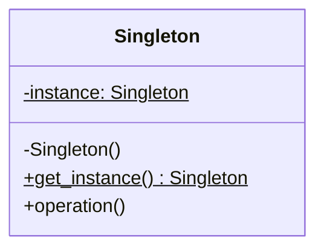

**Caution:** Use sparingly. Singletons introduce global state, which can make testing
and maintenance harder. Only use when exactly-one-instance is a genuine requirement.

---

## Structural Patterns

### 10. Adapter

**Problem it solves:** Existing code has an incompatible interface that must work with
application code, and neither can be modified.

**When to use:**
- Integrating external or legacy code with a different interface
- Cannot modify either the application code or the external code
- Need to isolate the application from future interface changes in external code

**Generic model participants:**
- **TargetInterface** (interface) — The interface the application expects.
- **Adaptee** (class) — The existing class with the incompatible interface.
- **Adapter** (class) — Implements TargetInterface and wraps the Adaptee, translating
  calls from the target interface to the adaptee's interface.
- **Client** — Uses the TargetInterface.

**Mermaid class diagram:**
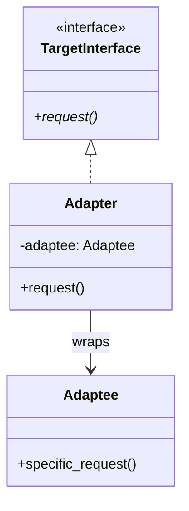

---

### 11. Facade

**Problem it solves:** A complex subsystem of classes has many interfaces, and client
code needs a simpler, unified interface.

**When to use:**
- A subsystem has many classes with complex interactions
- Client code needs only a subset of the subsystem's functionality
- Simplify access without modifying the subsystem

**Generic model participants:**
- **Facade** (class) — Provides a simplified interface. Delegates to subsystem classes.
- **SubsystemClasses** — The existing complex classes. Unaware of the facade.
- **Client** — Uses the Facade instead of interacting with subsystem directly.

**Mermaid class diagram:**
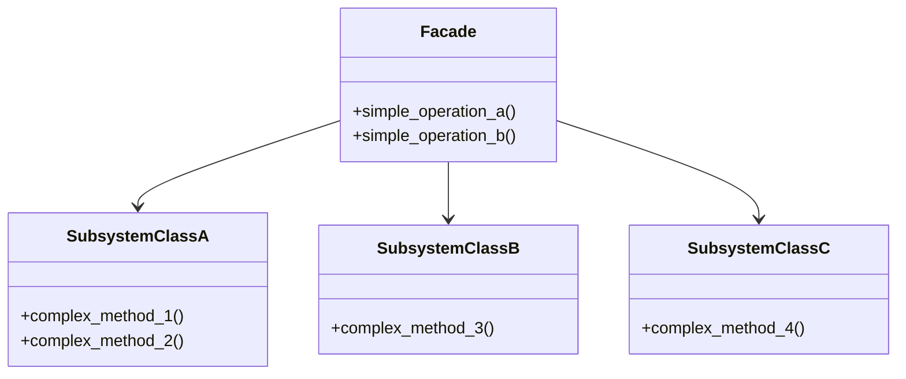

### Adapter vs Facade

| Criterion | Adapter | Facade |
|-----------|---------|--------|
| Purpose | Make incompatible interface compatible | Simplify complex subsystem interface |
| Scope | Wraps one class | Wraps multiple subsystem classes |
| Direction | Translates interface A to interface B | Provides new simplified interface |
| When to choose | Integrating external code with different interface | Simplifying access to complex subsystem |

---

### 12. Composite

**Problem it solves:** Individual objects and compositions of objects must be treated
uniformly through a common interface.

**When to use:**
- Objects form a tree/hierarchy structure
- Client code should treat individual and composite objects the same way
- Operations should propagate through the tree

**Generic model participants:**
- **ComponentInterface** (interface) — Declares operations common to both leaves and
  composites.
- **Leaf** (class) — Represents individual objects with no children.
- **Composite** (class) — Contains children (other Components). Implements operations
  by delegating to children.

**Mermaid class diagram:**
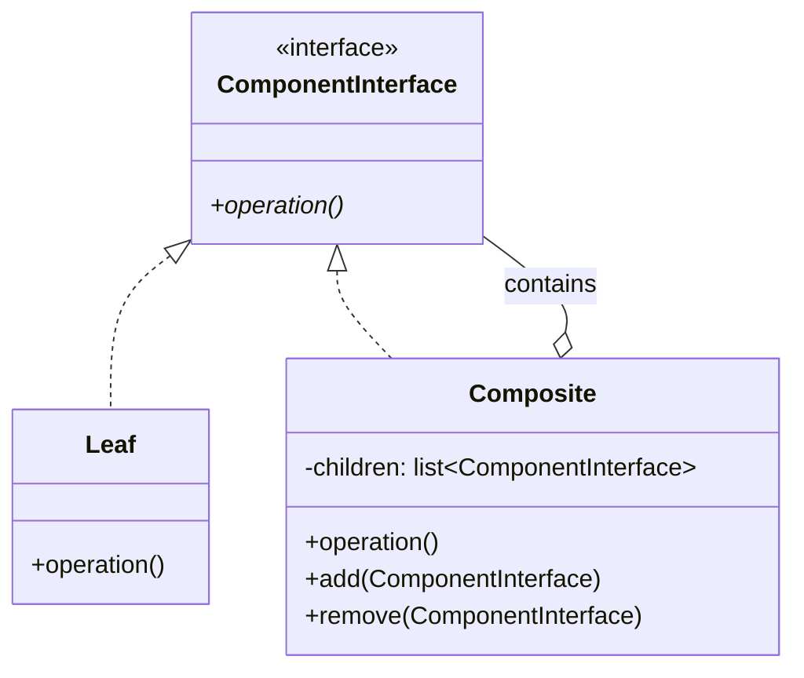

---

### 13. Decorator

**Problem it solves:** Responsibilities must be added to an object dynamically at
runtime, without modifying the object's class.

**When to use:**
- Additional behaviors or attributes needed at runtime
- Subclassing for every combination would cause class explosion
- Decorations should be stackable/combinable

**Generic model participants:**
- **ComponentInterface** (interface) — Declares the interface for objects that can
  be decorated.
- **ConcreteComponent** (class) — The base object being decorated.
- **DecoratorBase** (abstract class) — Implements ComponentInterface, holds a reference
  to a wrapped ComponentInterface. Delegates to the wrapped object.
- **ConcreteDecorator** (classes) — Each adds specific behavior before/after delegating.

**Mermaid class diagram:**
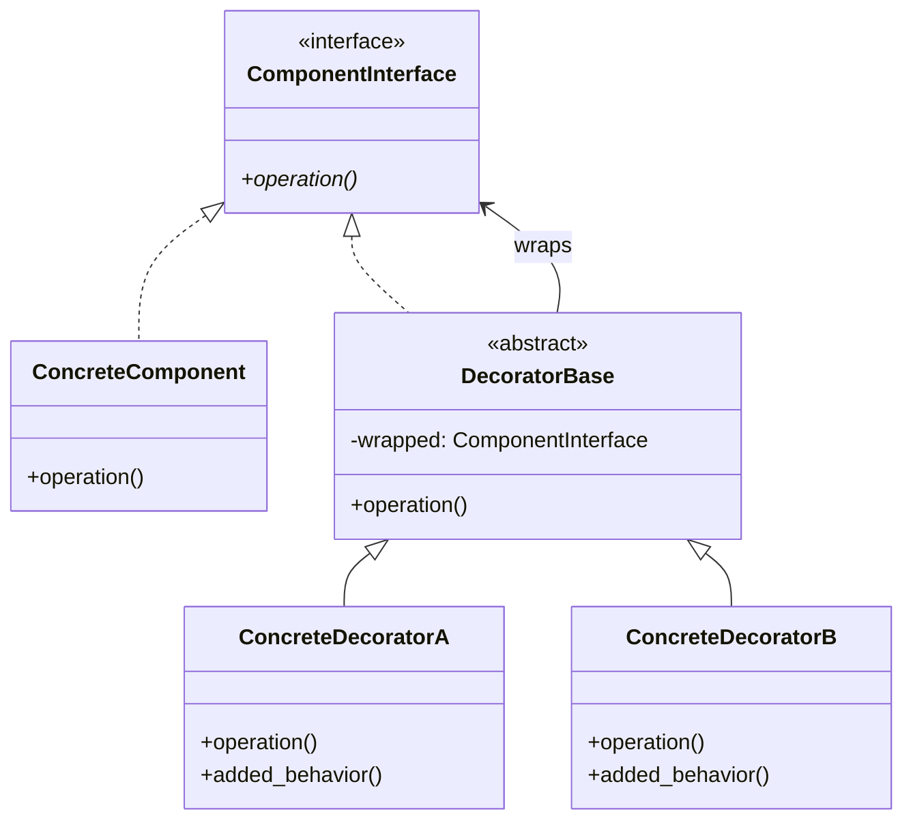

---

## Pattern Selection Guide

When evaluating a design for pattern opportunities, use these questions:

| Question | Suggested Pattern |
|----------|-------------------|
| Do multiple classes share an algorithm with some varying steps? | Template Method |
| Must algorithms be interchangeable at runtime? | Strategy |
| Must a single algorithm work across different collection types? | Iterator |
| Must different algorithms operate on one data structure? | Visitor |
| Does one data source feed multiple independent consumers? | Observer |
| Does an object's behavior depend on its named state? | State |
| Should subclasses decide which objects to create? | Factory Method |
| Must families of related objects be created without mixing? | Abstract Factory |
| Must exactly one instance of a class exist? | Singleton |
| Must external code with a different interface be integrated? | Adapter |
| Does a complex subsystem need a simpler interface? | Facade |
| Must individual and composite objects be treated uniformly? | Composite |
| Must responsibilities be added to objects dynamically? | Decorator |

Multiple patterns can apply to a single application. Present recommendations with
rationale tied to the specific architecture problem identified in the user's design.
