# UML Notation Guide — Mermaid Syntax

All UML diagrams use Mermaid syntax by default. This reference covers the four diagram
types used in the design process: class diagrams, use case diagrams (approximated),
state diagrams, and sequence diagrams.

---

## Class Diagrams

Class diagrams are the primary design deliverable. They document classes, their
members, and relationships.

### Class Definition

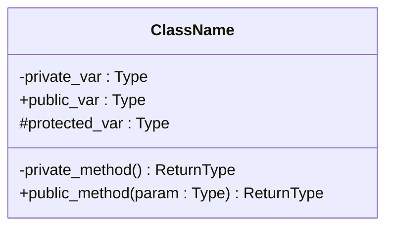

**Visibility prefixes:**
- `-` private
- `+` public
- `#` protected

**Conventions:**
- List instance variables in the top section, methods below
- Omit constructors and destructors unless design-relevant
- Omit getters/setters unless they are part of the design discussion
- Mark static members with `$` suffix: `+get_instance()$ Singleton`

### Abstract Classes and Interfaces

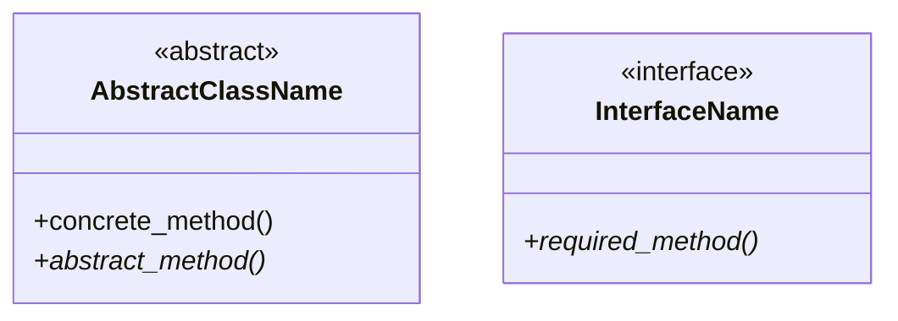

- Use `<<abstract>>` annotation for abstract classes
- Use `<<interface>>` annotation for interface classes
- Append `*` to abstract method names to indicate they must be implemented

### Relationships

#### Dependency (basic relationship)

A uses B (transient — through parameters or local variables, not instance variables).

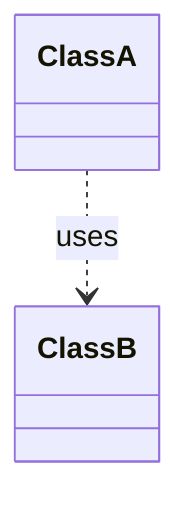

Dashed arrow. The dependency exists only during method calls.

#### Association (persistent reference)

A knows about B (through an instance variable).

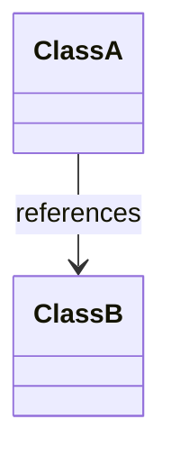

Solid arrow. A holds a reference to B as an instance variable.

#### Aggregation (contains, loosely)

A contains B, but B can exist independently outside of A.

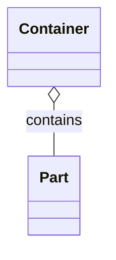

Open diamond on the container side. B objects can logically exist without A.

#### Composition (contains, strongly)

A contains B, and B cannot exist without A.

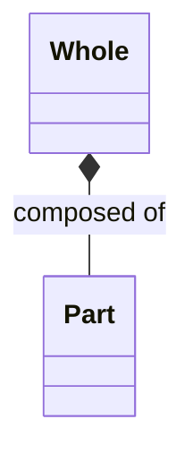

Filled diamond on the whole side. B objects cannot logically exist outside of A.

#### Generalization (inheritance)

B is a subclass of A.

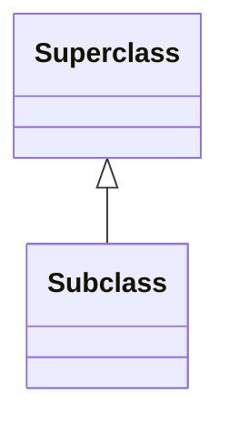

Solid line with open triangle pointing to superclass.

#### Interface Implementation

B implements interface A.

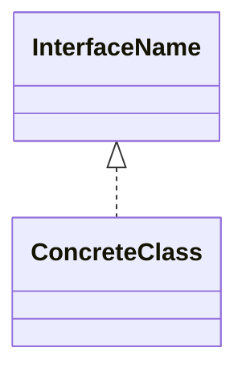

Dashed line with open triangle pointing to interface.

### Multiplicity

Add cardinality labels to relationships:

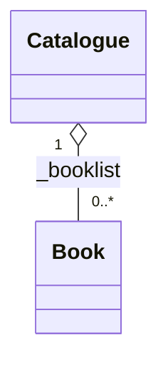

Common multiplicity values:
- `1` — exactly one
- `0..1` — zero or one
- `0..*` or `*` — zero or more
- `1..*` — one or more
- `2..5` — specific range

### Relationship Labels

Label relationships with the instance variable name or role:

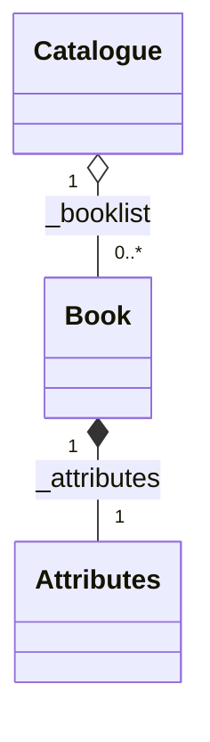

### Complete Class Diagram Example

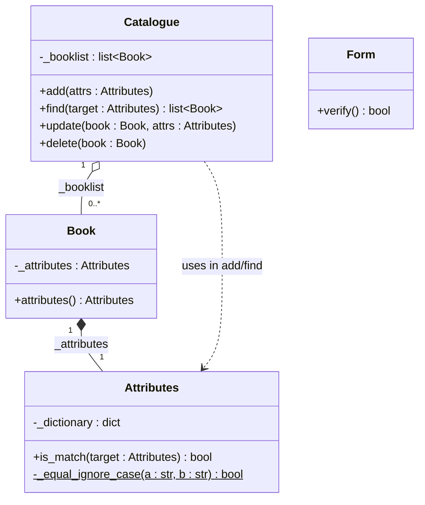

### Relationship Summary Table

| Relationship | Mermaid Syntax | Meaning |
|-------------|----------------|---------|
| Dependency | `A ..> B` | A uses B transiently |
| Association | `A --> B` | A holds reference to B |
| Aggregation | `A o-- B` | A contains B (B can exist alone) |
| Composition | `A *-- B` | A contains B (B cannot exist alone) |
| Generalization | `A <\|-- B` | B inherits from A |
| Implementation | `A <\|.. B` | B implements interface A |

---

## Use Case Diagrams

Mermaid does not have a native use case diagram type. Approximate with a block diagram
or use a structured text format.

### Text-Based Use Case Diagram

When Mermaid's block diagram is insufficient, produce a structured text representation:

```
┌─────────────────────────────────────────────────┐
│                  Application Name                │
│                                                  │
│   ┌──────────────┐     ┌──────────────┐         │
│   │  Use Case 1  │     │  Use Case 2  │         │
│   └──────────────┘     └──────────────┘         │
│   ┌──────────────┐     ┌──────────────┐         │
│   │  Use Case 3  │     │  Use Case 4  │         │
│   └──────────────┘     └──────────────┘         │
└─────────────────────────────────────────────────┘
    │         │               │          │
 Actor A   Actor A         Actor B    Actor B
```

The outer box represents the application boundary. Actors are outside the boundary.
Lines show which actors interact with which use cases.

### Use Case Description Template

For each use case, produce a structured description:

```markdown
**Use Case:** <Verb-Noun Name>
- **Goal:** <What the actor is trying to achieve>
- **Summary:** <One or two sentences>
- **Actors:** <Who/what interacts>
- **Preconditions:** <What must be true before>
- **Trigger:** <What starts this use case>
- **Primary Sequence:**
  1. <step>
  2. <step>
  ...
- **Alternate Sequences:**
  - A1 — <condition>: <steps>
- **Postconditions:** <What is true when finished>
- **Nonfunctional:** <Which nonfunctional requirements apply>
```

Keep to 10 steps maximum per primary sequence. Break complex use cases into smaller
ones that reference each other.

---

## State Diagrams

State diagrams show runtime state transitions for a single object.

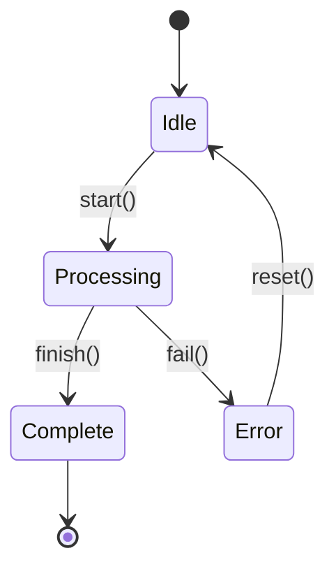

**Conventions:**
- `[*]` represents start and end points
- Each box is a named state
- Arrows show transitions labeled with the event/action causing them
- Include decision branches with `<<choice>>` when needed

### State Diagram with Decisions

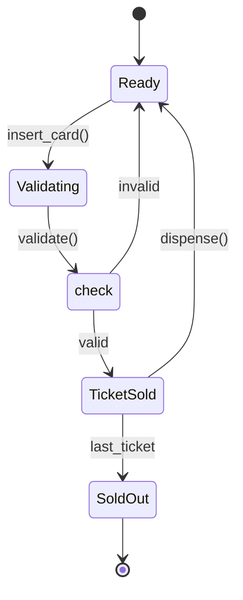

### When to Create State Diagrams

Create a state diagram when:
- An object has clearly named states (e.g., Ready, Processing, Complete, Error)
- Behavior depends on current state
- State transitions are triggered by specific events
- Invalid actions in certain states must be handled

---

## Sequence Diagrams

Sequence diagrams show runtime interactions between objects during a use case.

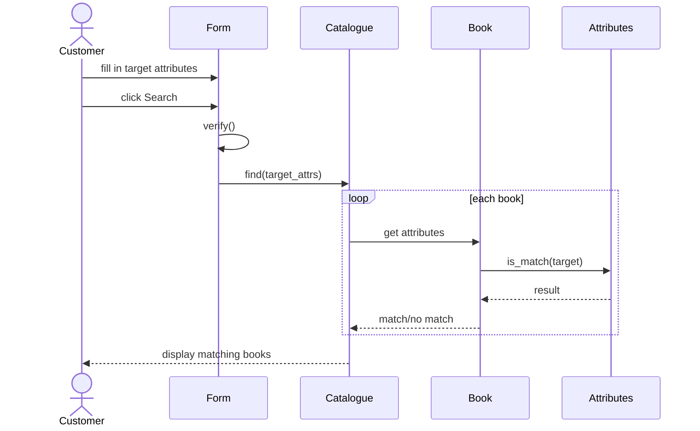

**Conventions:**
- Time flows top to bottom
- `actor` for human participants (stick figures)
- `participant` for system objects
- Solid arrows (`->>`) for calls/messages
- Dashed arrows (`-->>`) for returns/responses
- Use `loop`, `alt`, `opt`, `par` blocks for control flow
- Keep interactions at a high level — show what, not how

### When to Create Sequence Diagrams

Create a sequence diagram when:
- A use case involves complex interactions among multiple objects
- The order of method calls matters
- It is important to verify that class relationships are designed correctly
- Delegation chains need to be visualized

---

## Diagram Selection Guide

| Diagram Type | When to Use | What It Shows |
|-------------|-------------|---------------|
| Class diagram | Always (primary deliverable) | Classes, members, relationships |
| Use case diagram | Always (from Phase 3) | Actor-application interactions |
| State diagram | When objects have named states | State transitions for one object |
| Sequence diagram | For complex multi-object interactions | Runtime message flow during a use case |

---

## Formatting Conventions

1. **One diagram per concern** — Do not overload a single diagram. Split large class
   diagrams into subsystems if needed.
2. **Label relationships** — Always label with instance variable names or roles.
3. **Include multiplicity** — Add cardinality when relationships involve collections.
4. **Consistent naming** — Use the same class/method names across all diagrams.
5. **Progressive detail** — Start with high-level diagrams (class names only), add
   detail (members, relationships) as the design matures through iterations.
