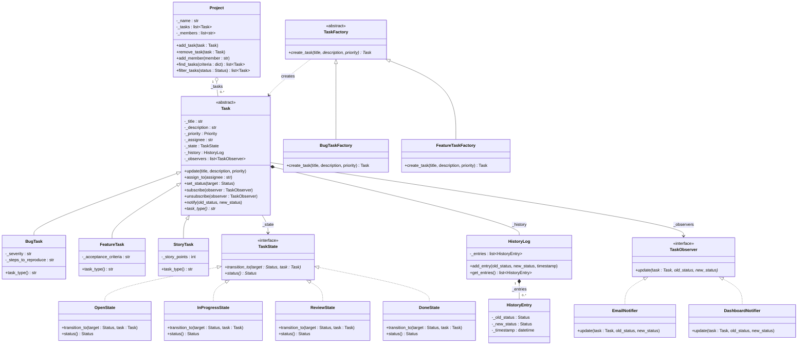
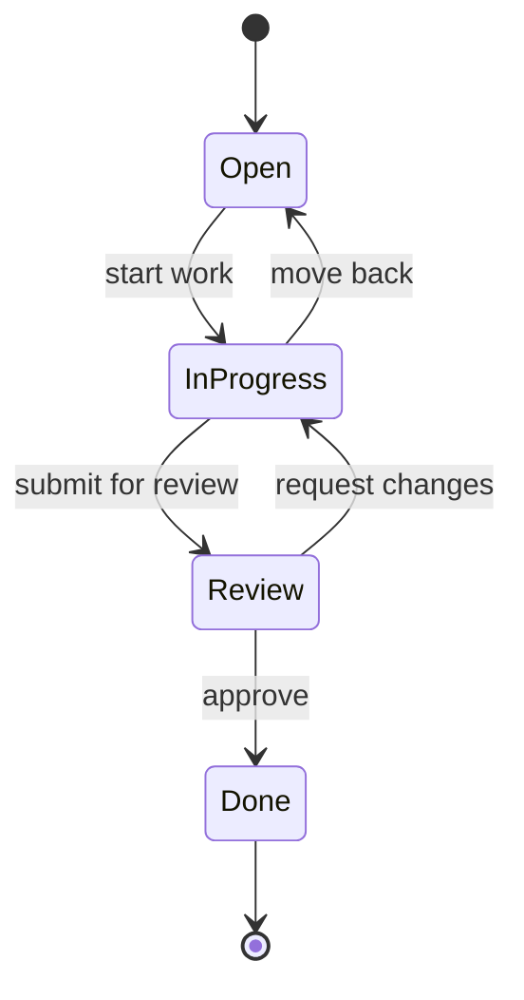
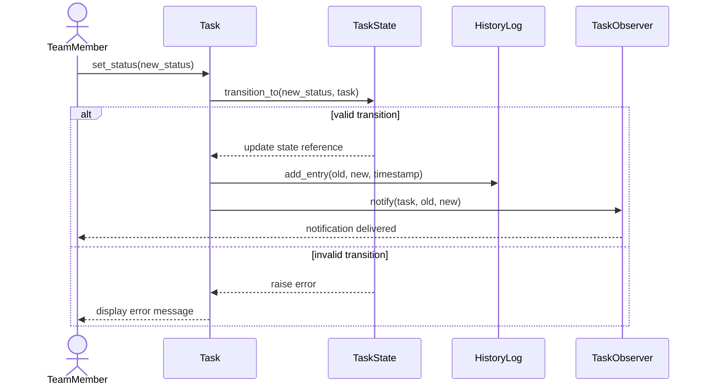

# Worked Example: TaskFlow — A Task Management Application

This reference demonstrates the complete OOP design process applied to a task management
application. It shows all phases, including textual analysis, design principle evaluation,
design pattern application, and Mermaid UML output.

---

## Phase 1: Problem Statement

```
APPLICATION: TaskFlow
PROBLEM: A task management application that allows team members to create, assign,
         prioritize, and track tasks organized into projects, with notifications
         when task status changes.
ACTORS: TeamMember (creates/manages tasks), ProjectManager (manages projects,
        assigns tasks), NotificationService (external — delivers notifications)
SCOPE NOTES: The notification delivery mechanism is external. User authentication
             is external. The application manages task lifecycle, project organization,
             and notification triggering.
```

---

## Phase 2: Requirements

### Functional Requirements

1. A team member must be able to create a new task with a title, description, and priority.
2. A team member must be able to update a task's title, description, priority, and status.
3. A team member must be able to delete a task.
4. A project manager must be able to create and delete projects.
5. A project manager must be able to assign tasks to a project.
6. A project manager must be able to assign a task to a team member.
7. Task priority must include: low, medium, high, and critical.
8. Task status must include: open, in_progress, review, and done.
9. A task must transition through valid status changes only (open -> in_progress ->
   review -> done, with the ability to move back one step).
10. The system shall notify all team members assigned to a project when a task's status
    changes.
11. A team member must be able to search for tasks by title, status, priority, or
    assignee.
12. A team member must be able to filter tasks within a project.
13. String matching during searches shall be case-insensitive.
14. The system shall maintain a history log of all status changes for each task.

### Nonfunctional Requirements

1. Task searches must return results in under 1 second.
2. The application must support at least 100 concurrent projects.
3. The notification mechanism must be replaceable without modifying application code.
4. The application must be extensible to support new task types (bugs, features,
   stories) without modifying existing task code.

---

## Phase 3: Use Cases

### Use Case Diagram

```
┌─────────────────────────────────────────────────────────┐
│                       TaskFlow                           │
│                                                          │
│   ┌───────────────┐    ┌───────────────┐                │
│   │  Create Task   │    │ Assign Task   │                │
│   └───────────────┘    └───────────────┘                │
│   ┌───────────────┐    ┌───────────────┐                │
│   │ Update Status  │    │ Search Tasks  │                │
│   └───────────────┘    └───────────────┘                │
│   ┌───────────────┐    ┌───────────────┐                │
│   │ Manage Project │    │ View History  │                │
│   └───────────────┘    └───────────────┘                │
└─────────────────────────────────────────────────────────┘
     │        │              │          │            │
 TeamMember  TeamMember  ProjectMgr  TeamMember  Notification
                                                  Service
```

### Use Case Description: Update Status

**Use Case:** Update Task Status
- **Goal:** Change a task's status to reflect current progress
- **Summary:** A team member updates a task's status, triggering validation of the
  transition and notification to project members.
- **Actors:** TeamMember, NotificationService
- **Preconditions:** Task exists and is assigned to the team member.
- **Trigger:** Team member selects a new status for the task.
- **Primary Sequence:**
  1. The team member selects a task and chooses a new status.
  2. The application validates the status transition.
  3. The application updates the task's status.
  4. The application records the change in the task's history log.
  5. The application notifies all team members assigned to the task's project.
  6. The team member sees the updated task.
- **Alternate Sequences:**
  - A1 — Invalid transition: Display error message explaining valid transitions.
    Return to step 1.
- **Postconditions:** Task status is updated. History log records the change. Project
  members are notified.
- **Nonfunctional:** Notification mechanism must be replaceable (NFR 3).

---

## Phase 4: Textual Analysis

### 4a. Noun Analysis

| Noun | Class? | Reasoning |
|------|--------|-----------|
| task | Yes | Core entity the application manages |
| title | No | Attribute value (string) |
| description | No | Attribute value (string) |
| priority | No | Attribute value (enumeration: low, medium, high, critical) |
| status | No | Attribute value (enumeration: open, in_progress, review, done) |
| project | Yes | Container for tasks, has its own state and behavior |
| team member | No | Actor external to the application |
| project manager | No | Actor external to the application |
| notification | Yes | The application triggers notifications — manages subscriber list |
| history log | Yes | Tracks status changes per task — has its own state |
| search | No | An operation, not an entity |
| assignee | No | A reference to an actor (string identifier) |

**Result:** Four initial classes — Task, Project, NotificationManager, HistoryLog.

### 4b. Class State Table

| Class | State (what it tracks) | Instance Variables |
|-------|------------------------|--------------------|
| Task | Task attributes and current status | _title, _description, _priority, _status, _assignee, _history |
| Project | Collection of tasks and members | _name, _tasks, _members |
| NotificationManager | List of observers | _observers |
| HistoryLog | List of status change entries | _entries |

### 4c. Verb-to-Method Table

| Verb | Class | Method |
|------|-------|--------|
| create (task) | Project | add_task() — create and add a task to the project |
| update | Task | update() — update task attributes |
| delete | Project | remove_task() — remove a task from the project |
| assign (to project) | Project | add_task() — assign a task to the project |
| assign (to member) | Task | assign_to() — set the task's assignee |
| transition | Task | set_status() — validate and change status |
| notify | NotificationManager | notify() — notify all observers of a change |
| search | Project | find_tasks() — search tasks by criteria |
| filter | Project | filter_tasks() — filter tasks within the project |
| record | HistoryLog | add_entry() — record a status change |

---

## Phase 5: Design Principle Evaluation

| Principle | Status | Finding | Recommendation |
|-----------|--------|---------|----------------|
| SRP | WARN | Task handles attributes, status transitions, AND history | Extract status transition logic; HistoryLog is already separate — good |
| PoLK | PASS | Classes communicate through methods, not internals | — |
| OCP | WARN | Adding new task types (NFR 4) would require modifying Task | Use inheritance: abstract Task with concrete subtypes |
| PoLA | PASS | Method names clearly describe behavior | — |
| LSP | N/A | No inheritance yet | Will evaluate after adding task type hierarchy |
| LoD | PASS | No method chains identified | — |
| FCoI | WARN | Notification logic could be hardcoded into Task | Use Observer pattern — compose notification behavior |
| CtIP | WARN | NotificationManager should depend on an interface | Define ObserverInterface for notification subscribers |

### Design Changes from Principle Evaluation

1. **SRP fix:** Extract status transition validation into a separate mechanism.
   The State pattern is a candidate — each status becomes a state object that
   knows which transitions are valid. (Deferred to Phase 6.)
2. **OCP fix:** Make Task abstract. Create concrete subclasses: BugTask,
   FeatureTask, StoryTask. Each can have additional attributes without modifying
   existing code.
3. **FCoI/CtIP fix:** Define an ObserverInterface. NotificationManager implements
   the publisher side. Concrete observers implement the subscriber side.

---

## Phase 6: Design Patterns Applied

### Pattern 1: Observer — Task Status Notifications

**Architecture problem:** When a task's status changes, multiple project members must
be notified. The task should not know how notifications are delivered (NFR 3).

**Application:**
- **ConcreteSubject:** Task — calls `notify()` when status changes
- **ObserverInterface:** TaskObserver — declares `update(task, old_status, new_status)`
- **ConcreteObservers:** EmailNotifier, DashboardNotifier, LogNotifier

This satisfies NFR 3 (notification mechanism must be replaceable) — add new observers
without modifying Task.

### Pattern 2: State — Task Status Transitions

**Architecture problem:** Task behavior depends on its current status (FR 9). Only
certain transitions are valid. Status-dependent logic would otherwise require
conditional chains.

**Application:**
- **Context:** Task — holds reference to current TaskState
- **StateInterface:** TaskState — declares `transition_to(target_status, task)`
- **ConcreteStates:** OpenState, InProgressState, ReviewState, DoneState

Each state object knows which transitions are valid from its state and rejects
invalid ones.

### Pattern 3: Factory Method — Task Type Creation

**Architecture problem:** New task types (bug, feature, story) must be addable
without modifying existing code (NFR 4).

**Application:**
- **CreatorInterface:** TaskFactory (abstract) — declares `create_task()`
- **ConcreteCreators:** BugTaskFactory, FeatureTaskFactory, StoryTaskFactory
- **ProductInterface:** Task (abstract)
- **ConcreteProducts:** BugTask, FeatureTask, StoryTask

---

## Phase 7: UML Diagrams

### Class Diagram



### State Diagram — Task Status Transitions



### Sequence Diagram — Update Task Status



---

## Design Notes & Open Questions

- The `Priority` and `Status` types are enumerations, not classes.
- `HistoryEntry` is a simple data class (no behavior beyond holding values). It
  exists as a separate class for clarity, but could be a named tuple or data class
  in implementation.
- Authentication and authorization are outside the application boundary. The design
  assumes the actor's identity is provided by an external system.
- Search implementation details (indexing, query optimization) are deferred to
  implementation.

## Iteration Log

| Iteration | What Changed | Why |
|-----------|-------------|-----|
| 1 | Initial classes from textual analysis | Baseline design from requirements |
| 2 | Made Task abstract, added BugTask/FeatureTask/StoryTask | OCP violation — NFR 4 requires extensibility |
| 3 | Added State pattern for status transitions | SRP violation — status transition logic was in Task; State pattern models valid transitions cleanly |
| 4 | Added Observer pattern for notifications | FCoI violation — notification logic was coupled to Task; Observer satisfies NFR 3 (replaceable mechanism) |
| 5 | Added Factory Method for task creation | CtIP — decouple task creation from concrete types |
